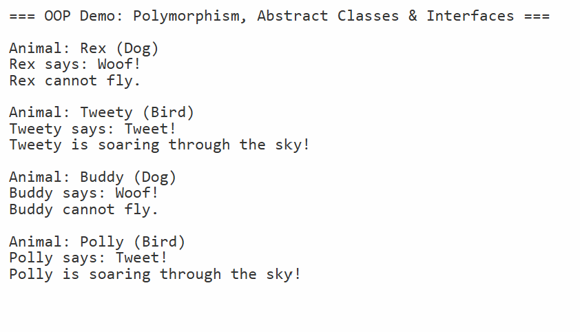

# 🐾 OOP Demo — Polymorphism, Abstract Classes & Interfaces

A C# (.NET Core 3.1) project that demonstrates core object-oriented
programming (OOP) principles using an animal class hierarchy. The project
models dogs and birds through an abstract base class, concrete derived
classes, and an interface — showing how polymorphism allows different
object types to be treated uniformly.

---

## 📋 Features

- `Animal` abstract base class defines shared properties and enforces
  method overrides in all derived classes
- `Dog` and `Bird` concrete classes each provide their own implementation
  of `MakeSound()` and `Describe()`
- `IFlyable` interface defines a `Fly()` contract implemented only by `Bird`
- `Program.cs` stores all animals in a `List<Animal>` and iterates
  polymorphically — the correct override is called automatically at runtime
- Interface check using pattern matching (`is IFlyable`) to safely call
  `Fly()` only on animals that support it

---

## ⚙️ How It Works

- `Animal` is an `abstract` class — it cannot be instantiated directly
  but defines the shared `Name` property and the abstract `MakeSound()`
  and virtual `Describe()` methods that all animals must implement
- `Dog` extends `Animal` and overrides `MakeSound()` to print a bark
- `Bird` extends `Animal` and also implements `IFlyable`, overriding
  `MakeSound()` and providing a `Fly()` method
- `Program.cs` creates a mixed list of `Dog` and `Bird` objects referenced
  through the `Animal` base type and loops through them — demonstrating
  that the correct method is resolved at runtime, not compile time

---

## 💡 Example Output

```
=== OOP Demo: Polymorphism, Abstract Classes & Interfaces ===

Animal: Rex (Dog)
Rex says: Woof!
Rex cannot fly.

Animal: Tweety (Bird)
Tweety says: Tweet!
Tweety is soaring through the sky!

Animal: Buddy (Dog)
Buddy says: Woof!
Buddy cannot fly.

Animal: Polly (Bird)
Polly says: Tweet!
Polly is soaring through the sky!
```

---

## 🛠️ Technologies Used

| Technology       | Purpose                                          |
|------------------|--------------------------------------------------|
| C# 8.0           | Core programming language                        |
| .NET Core 3.1    | Runtime framework                                |
| Abstract Classes | Shared structure with enforced method overrides  |
| Interfaces       | Contract-based capability definition (`IFlyable`)|
| Polymorphism     | Unified treatment of different object types      |
| `List<Animal>`   | Polymorphic collection storing mixed animal types|
| Pattern Matching | `is IFlyable` check for safe interface casting   |

---

## 🎓 Learning Outcomes

- Understanding the difference between abstract classes and interfaces
- Using `abstract` and `override` keywords for enforced method overriding
- Using `virtual` for optional overrides with a default implementation
- Calling `base.Describe()` from derived classes to reuse base logic
- Storing derived types in a base class `List<T>` for polymorphic iteration
- Using `is` pattern matching to safely check interface implementation at runtime

---

## 📁 Folder Structure

```
Array-animals/
├── Animal.cs           ← Abstract base class
├── Bird.cs             ← Derived class implementing Animal and IFlyable
├── Dog.cs              ← Derived class implementing Animal
├── IFlyable.cs         ← Interface defining the Fly() contract
├── Program.cs          ← Runner — creates animals and iterates polymorphically
├── array_animals.png   ← Console output screenshot
├── .gitignore
├── LICENSE
└── README.md
```

---

## 🚀 How to Run

### Prerequisites
- [.NET Core 3.1 SDK](https://dotnet.microsoft.com/download/dotnet/3.1)

### Steps

```bash
# Clone the repository
git clone https://github.com/MissMarzelous/Array-animals.git

# Navigate into the project folder
cd Array-animals

# Run the application
dotnet run
```

---

## 📸 Screenshots

### Console Output



---

## 👩‍💻 Author

**MissMarzelous** — C# .NET Core student project
